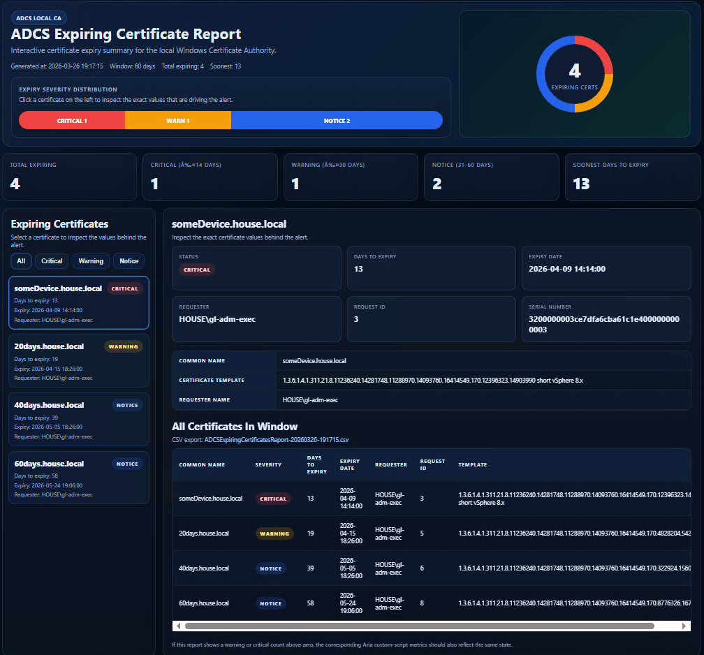

# ADCS Certificate Expiry Monitoring for VMware Aria Operations

PowerShell scripts for monitoring Microsoft Active Directory Certificate Services (ADCS) certificate expiry from **VMware Aria Operations** using **product-managed Telegraf Custom Scripts**, plus a detailed local HTML/CSV report for operational follow-up.

This project is designed around a key constraint of the Aria Operations Custom Script workflow: **each custom script must return a single integer value**. Because of that, the monitoring design is split into:

- **small metric scripts** that each return one integer for Aria Operations
- **one detailed report script** that writes a rich local report showing exactly which certificates are driving the alert

The scripts assume they are executed **locally on a Windows Certificate Authority server** and therefore do **not** require a hard-coded `-config` parameter.

---



## What this project provides

### Metric scripts for Aria Operations

These scripts are intended to be configured as individual **Custom Script** objects in Aria Operations:

- `Get-ADCSCollectionStatus.ps1`
- `Get-ADCSExpiringCertificateCount60Days.ps1`
- `Get-ADCSWarningCertificateCount30Days.ps1`
- `Get-ADCSCriticalCertificateCount14Days.ps1`
- `Get-ADCSSoonestDaysToExpiry60Days.ps1`

Each script returns **one integer only**.

### Shared library

- `ADCSMetricLib.ps1`

This file contains the common logic used by all metric scripts and the report script, including:

- `certutil.exe` discovery
- `certutil -view ... csv` execution
- CSV parsing
- certificate expiry date parsing
- revoked certificate lookup handling
- filtering of issued, non-revoked certificates inside a defined expiry window
- error logging

### Detailed report script

- `Get-ADCSExpiringCertificateReport.ps1`

This script generates a local report showing **which certificates are causing the expiry alerts**, including:

- HTML dashboard report
- CSV export
- latest summary text file

By default, reports are written to a **`Reports`** sub-folder beneath the script location.

---

## Repository contents

```text
ADCSMetricLib.ps1
Get-ADCSCollectionStatus.ps1
Get-ADCSCriticalCertificateCount14Days.ps1
Get-ADCSExpiringCertificateCount60Days.ps1
Get-ADCSExpiringCertificateReport.ps1
Get-ADCSSoonestDaysToExpiry60Days.ps1
Get-ADCSWarningCertificateCount30Days.ps1
README.md
```

---

## How the solution works

### Monitoring path

Aria Operations calls each metric script separately through the **Manage Telegraf Agents > Custom Script** workflow.

Each script:

1. loads `ADCSMetricLib.ps1`
2. queries the local CA database via `certutil`
3. filters out revoked certificates
4. evaluates the relevant expiry window
5. returns a single integer to stdout

### Reporting path

When an alert is triggered, an operator can log onto the CA server and run the report script. The report script:

1. reuses the same local CA logic as the metric scripts
2. builds an enriched in-memory list of expiring certificates
3. classifies each certificate as:
   - `critical` (`<= 14 days`)
   - `warning` (`<= 30 days`)
   - `notice` (`31-60 days`)
4. generates:
   - a styled HTML dashboard
   - a CSV export
   - a text summary file

This keeps the Aria metric collection clean and reliable while still giving operations staff full certificate detail when they need it.

---

## Assumptions and design decisions

- The scripts run **on the Windows CA server itself**.
- The server hosts the CA instance the scripts should query.
- The environment uses **Microsoft ADCS** and `certutil.exe` is available.
- The Aria Operations Custom Script parser accepts **single integer output only**.
- Rich multi-line or structured output is therefore **not** returned to Aria from the metric scripts.
- Certificate detail is handled through the **separate report script**.

If a server hosts multiple CA instances and local `certutil` selection becomes ambiguous, this design may need to be adapted.

---

## Prerequisites

- Windows Server hosting an ADCS Certificate Authority
- `certutil.exe` available in the PATH
- PowerShell enabled
- VMware Aria Operations with a **product-managed Telegraf agent** installed on the CA server
- Sufficient rights for the script execution context to query the local CA database

---

## Installation

### 1. Copy files to the CA server

Copy all `.ps1` files into the same folder, for example:

```text
C:\Scripts
```

Important:

- `ADCSMetricLib.ps1` must remain in the **same folder** as all metric scripts and the report script
- the report script defaults to writing output to:

```text
C:\Scripts\Reports
```

### 2. Verify local execution first

Run the metric scripts locally before configuring Aria Operations.

```powershell
powershell.exe -NoProfile -ExecutionPolicy Bypass -File "C:\Scripts\Get-ADCSCollectionStatus.ps1"
powershell.exe -NoProfile -ExecutionPolicy Bypass -File "C:\Scripts\Get-ADCSExpiringCertificateCount60Days.ps1"
powershell.exe -NoProfile -ExecutionPolicy Bypass -File "C:\Scripts\Get-ADCSWarningCertificateCount30Days.ps1"
powershell.exe -NoProfile -ExecutionPolicy Bypass -File "C:\Scripts\Get-ADCSCriticalCertificateCount14Days.ps1"
powershell.exe -NoProfile -ExecutionPolicy Bypass -File "C:\Scripts\Get-ADCSSoonestDaysToExpiry60Days.ps1"
```

### 3. Configure Aria Operations Custom Script objects

Create one Aria Custom Script object per metric script.

Recommended settings:

**Prefix**

```text
%SYSTEMROOT%\System32\WindowsPowerShell\v1.0\powershell.exe -File
```

or, if preferred and proven to work in your environment:

```text
powershell -File
```

**Args**

Leave blank.

**Timeout**

5 minutes is generally fine for these scripts.

---

## Metric scripts and return values

### `Get-ADCSCollectionStatus.ps1`

Returns:

- `1` = certificate query succeeded
- `0` = query failed

Use this as the basic health/collection metric.

---

### `Get-ADCSExpiringCertificateCount60Days.ps1`

Returns:

- `0` or higher = number of issued, non-revoked certificates expiring in **60 days or less**
- `-1` = failure

---

### `Get-ADCSWarningCertificateCount30Days.ps1`

Returns:

- `0` or higher = number of issued, non-revoked certificates expiring in **30 days or less**
- `-1` = failure

---

### `Get-ADCSCriticalCertificateCount14Days.ps1`

Returns:

- `0` or higher = number of issued, non-revoked certificates expiring in **14 days or less**
- `-1` = failure

---

### `Get-ADCSSoonestDaysToExpiry60Days.ps1`

Returns:

- `0` or higher = smallest `DaysToExpiry` value found in the **60-day** window
- `-1` = no certificates found inside the 60-day window
- `-2` = failure

This is usually the most useful alert-driving metric.

---

## Suggested Aria Operations object names

- ADCS Collection Status
- ADCS Expiring Certificate Count 60 Days
- ADCS Warning Certificate Count 30 Days
- ADCS Critical Certificate Count 14 Days
- ADCS Soonest Days To Expiry 60 Days

---

## Suggested alert logic

### Critical

- `ADCS Collection Status < 1`
- `ADCS Critical Certificate Count 14 Days > 0`
- `ADCS Soonest Days To Expiry 60 Days >= 0 AND <= 14`

### Warning

- `ADCS Warning Certificate Count 30 Days > 0`
- `ADCS Soonest Days To Expiry 60 Days > 14 AND <= 30`

These are example thresholds and can be adapted to match local operational policy.

---

## Report script

### `Get-ADCSExpiringCertificateReport.ps1`

This script produces a detailed local report showing exactly which certificates are contributing to the metrics and alerts.

### Parameters

```powershell
param(
    [int]$WindowDays = 60,
    [string]$OutputFolder = "$PSScriptRoot\Reports",
    [switch]$OpenReport
)
```

### Default behaviour

- scans the local CA for issued, non-revoked certificates within the selected window
- classifies them as `critical`, `warning`, or `notice`
- writes output to the `Reports` sub-folder by default
- writes the generated HTML path to stdout
- optionally opens the HTML report when `-OpenReport` is used

### Example usage

Generate the default 60-day report:

```powershell
powershell.exe -NoProfile -ExecutionPolicy Bypass -File "C:\Scripts\Get-ADCSExpiringCertificateReport.ps1"
```

Generate and open the report immediately:

```powershell
powershell.exe -NoProfile -ExecutionPolicy Bypass -File "C:\Scripts\Get-ADCSExpiringCertificateReport.ps1" -OpenReport
```

Generate a 30-day report:

```powershell
powershell.exe -NoProfile -ExecutionPolicy Bypass -File "C:\Scripts\Get-ADCSExpiringCertificateReport.ps1" -WindowDays 30
```

Write report output somewhere else:

```powershell
powershell.exe -NoProfile -ExecutionPolicy Bypass -File "C:\Scripts\Get-ADCSExpiringCertificateReport.ps1" -OutputFolder "C:\Temp\ADCSReports" -OpenReport
```

### Report output files

The script creates:

- `ADCSExpiringCertificatesReport-<timestamp>.html`
- `ADCSExpiringCertificatesReport-<timestamp>.csv`
- `ADCSExpiringCertificatesReport-latest.txt`

### Report contents

The report includes:

- generated date/time
- selected monitoring window
- total expiring count
- critical/warning/notice counts
- soonest days to expiry
- certificate list by severity
- certificate details including:
  - Common Name
  - Requester Name
  - Request ID
  - Serial Number
  - Expiry Date
  - Days To Expiry
  - Certificate Template
- CSV export file reference

---

## Logging

Errors are written to:

```text
ADCSMetricErrors.log
```

This file is created in the same folder as the scripts.

Example path:

```text
C:\Scripts\ADCSMetricErrors.log
```

### View recent log entries

```powershell
Get-Content "C:\Scripts\ADCSMetricErrors.log" -Tail 50
```

---

## Manual troubleshooting commands

### Verify raw issued certificate query

```powershell
certutil -silent -restrict "Disposition=20" -out "RequestID,RequesterName,CommonName,SerialNumber,NotAfter,CertificateTemplate" -view Log csv
```

### Verify raw revoked certificate query

```powershell
certutil -silent -out "RequestID,SerialNumber" -view Revoked csv
```

### Test shared library functions directly

```powershell
powershell.exe -NoProfile -ExecutionPolicy Bypass -Command ". 'C:\Scripts\ADCSMetricLib.ps1'; Get-ADCSIssuedCertificateRows | Select-Object -First 5 | Format-List *"
```

```powershell
powershell.exe -NoProfile -ExecutionPolicy Bypass -Command ". 'C:\Scripts\ADCSMetricLib.ps1'; (Get-ADCSRevokedLookup).Count"
```

```powershell
powershell.exe -NoProfile -ExecutionPolicy Bypass -Command ". 'C:\Scripts\ADCSMetricLib.ps1'; @(Get-ADCSExpiringCertificates -WindowDays 60).Count"
```

---

## Operational workflow

A typical operational flow looks like this:

1. Aria Operations raises a certificate expiry warning or critical alert
2. An operator checks which metric crossed threshold
3. The operator logs on to the CA server
4. The operator runs:

```powershell
powershell.exe -NoProfile -ExecutionPolicy Bypass -File "C:\Scripts\Get-ADCSExpiringCertificateReport.ps1" -OpenReport
```

5. The HTML report opens from:

```text
C:\Scripts\Reports
```

6. The operator uses the report to identify the certificates behind the alert
7. Renewal or remediation work is performed

---

## Limitations

- Designed for **local execution on the CA server**
- Not intended for a remote CA query model in its current form
- The Aria Custom Script path is intentionally kept to **integer-only output**
- Certificate-by-certificate detail is not returned directly to Aria
- If multiple CA instances exist locally, default `certutil` selection may need validation
- Template names are taken directly from CA query output and may be long or unfriendly depending on the environment

---

## Security and operational notes

- Review script execution policy requirements before deployment
- Test in a non-production environment first
- Confirm the execution context used by the product-managed Telegraf agent can query the CA database
- Protect access to generated reports if they contain sensitive certificate naming information
- Review whether report files should be periodically cleaned up from the `Reports` folder

---

## Recommended future enhancements

Potential future improvements for this project:

- scheduled automatic report generation
- emailing the latest report when warning/critical counts are non-zero
- optional filtering by certificate template
- optional filtering by requester
- friendlier template display names
- optional JSON output for non-Aria use cases
- automatic report retention cleanup

---

## Quick start

If you only want the minimum steps:

1. Copy all scripts to `C:\Scripts`
2. Test the metric scripts locally
3. Create five Aria Custom Script objects using `powershell.exe -File`
4. Leave `Args` blank
5. Set timeout to 5 minutes
6. Use the report script to investigate alerts

---

## Example local test block

```powershell
& {
  Write-Host "CollectionStatus:"
  powershell.exe -NoProfile -ExecutionPolicy Bypass -File "C:\Scripts\Get-ADCSCollectionStatus.ps1"

  Write-Host "ExpiringCertificateCount60Days:"
  powershell.exe -NoProfile -ExecutionPolicy Bypass -File "C:\Scripts\Get-ADCSExpiringCertificateCount60Days.ps1"

  Write-Host "WarningCertificateCount30Days:"
  powershell.exe -NoProfile -ExecutionPolicy Bypass -File "C:\Scripts\Get-ADCSWarningCertificateCount30Days.ps1"

  Write-Host "CriticalCertificateCount14Days:"
  powershell.exe -NoProfile -ExecutionPolicy Bypass -File "C:\Scripts\Get-ADCSCriticalCertificateCount14Days.ps1"

  Write-Host "SoonestDaysToExpiry60Days:"
  powershell.exe -NoProfile -ExecutionPolicy Bypass -File "C:\Scripts\Get-ADCSSoonestDaysToExpiry60Days.ps1"
}
```

---

## License

Add your preferred license here before publishing to GitHub.
